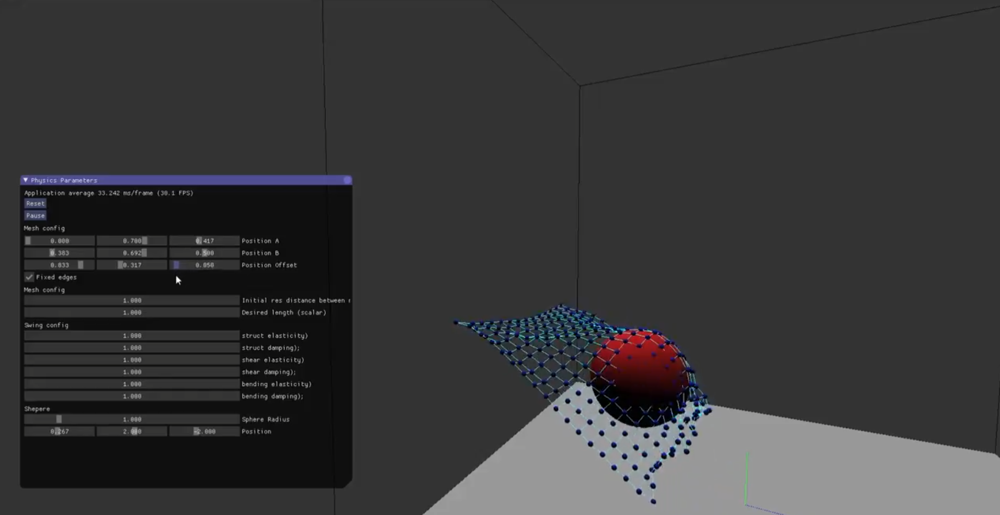
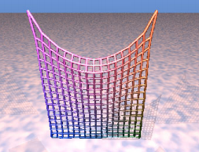
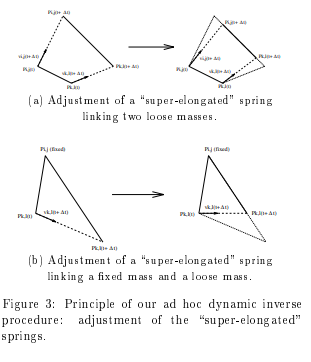
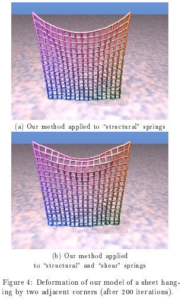
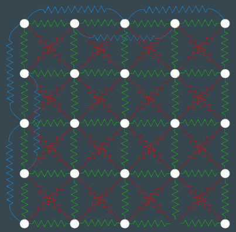

# Welcome!

This project is a cloth simulation written in C++. It uses the OpenGL API to render the cloth in real-time and imgui for the UI. Following the theory of this paper: https://bit.ly/2Vst2ex

## How does it works?

1⃣ Create a particle mesh connected by springs

2⃣ Every loop cycle, update the spring forces

3⃣ Handle the "rubbery deformation" if it's necessary

4⃣ Update the particles state using your favorite solver (Verlet, Eurler...)

### What does that "rubbery deformation" mean?

Since all the particles are updated by gravity, collision and spring forces separatedly, you can't ensure the particles are always preserving the distance between them. Due to this effect, every iteration is recommended to iterate the particles and clamp the distance between them.

Example of rubberty deformation:

To handle the rubbery deformation just clamp the distance between particles. (Using a for loop requires several iterations. Due to probably you're not going to prevent how the distance correction separates non-evaluated nodes).

Comparison:

# Understanding the spring net

Note that springs connection must repel hard folds. 
Interpreting the particles as "joints without resistance" you will realize that the spring structure should look like this. Use a very-low delta time for a high stiffness.

